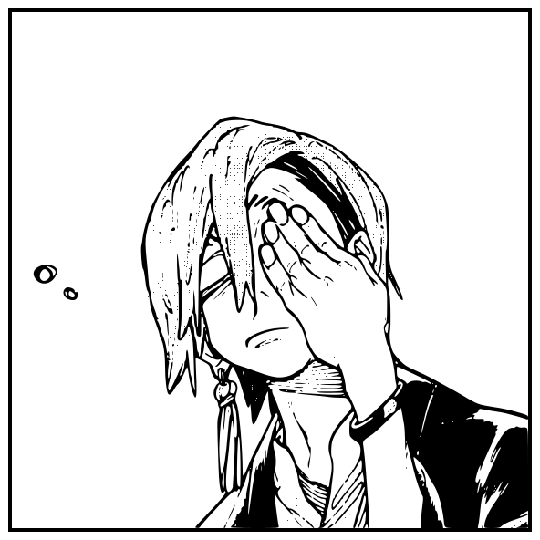

<div align="center">



# zanka.md

**A Claude Code skill that drills workflow fundamentals until they're reflex.**<br>
*Named after Zanka Nijiku of Gachiakuta — the Cleaners' drillmaster, whose ordinary stick outclasses every exotic weapon.*

</div>

---

[zanka.md](https://github.com/justin06lee/zanka.md) sets the non-negotiable basics for every project Claude touches. No exotic tricks — just the fundamentals, executed the same way every single time.

## The fundamentals

1. **READMEs done right.** Every project keeps an up-to-date README headed by a centered SVG banner, then the title, then a short description — everything below is left-anchored. Banners are always SVGs (reference images get converted to vector) in whatever style you describe (minimal flat vector by default), art-directed from reference imagery that loosely evokes the project — found by checking the user's existing repos for the style family, then hunting references for inspiration (candidates get opened in Preview to pick from when the direction is unclear). References are inspiration only; the committed art is always original vector work, and each banner's aspect ratio is rolled with a real RNG (two integers in 3–9, larger:smaller = width:height) so repos don't all converge on the same shape. A README that already has a banner keeps it untouched unless you explicitly ask for a new one. Badge/shield pills are banned outright — anything worth saying goes in prose instead. Body illustrations are generated only when words genuinely can't carry it.
2. **bun, always.** `bun install`, `bun run`, `bunx` — never npm, pnpm, yarn, or npx. Foreign lockfiles get migrated on sight.
3. **Complexity absorbed into `make`.** Anything beyond a one-command dev server gets a Makefile where a bare `make` runs the entire golden path. The full public surface is `make`, `make build`, `make install` (binary lands on `$PATH`, runnable from anywhere), and `make update`.
4. **macOS permissions handled programmatically.** Accessibility/TCC grants die when a binary is replaced, leaving a stale entry in System Settings. The Makefile quits Settings, `tccutil reset`s the app's grants, removes the stale binary, then installs and launches the fresh one so it re-prompts cleanly — no manual Settings archaeology, ever.
5. **MCP servers get used, not mentioned — but only when the project uses the service.** If the project actually integrates Supabase, Stripe, etc., Claude applies the migration or runs the operation itself instead of handing it back as a to-do — initiating authentication itself when a server isn't authed yet. Servers for services the project doesn't use are never probed.
6. **master, not main.** Every repo's default branch is `master` — new repos are initialized with `git init -b master`, and stray `main` branches get renamed on sight.
7. **No session ends on a broken build.** If the project has a build step, Claude runs the real production build (`bun run build` / `make build`) after its final change and fixes any failure before calling the work done — so a deploy never fails on something the session could have caught.

## `make update`

For live binaries and services, `make update` performs the full refresh cycle: stop every process, daemon, and agent tied to the current binary → delete the old binary → build the new one → install it → restart everything that was stopped.

## Install

With [bmo](https://github.com/justin06lee/bmo):

```bash
bmo add justin06lee/zanka.md
```

Or from a local clone:

```bash
bmo add .
```

Installs as the `zanka` skill (`/zanka` in Claude Code). It also triggers automatically at the start of project work — scaffolding, docs, builds, installs, releases, and permission wrangling.

## Who is Zanka?

[Zanka Nijiku](https://gachiakuta.fandom.com/wiki/Zanka_Nijiku) is a Cleaner of Team Akuta in *Gachiakuta*, appointed to train the protagonist Rudo in the fundamentals of wielding Vital Instruments. He's regarded as the best Vital Instrument handler among the Cleaners — his weapon, the Lovely Assistaff (愛棒), is a plain wooden staff mastered so thoroughly it needs to be nothing more. That's the whole thesis of this skill.
